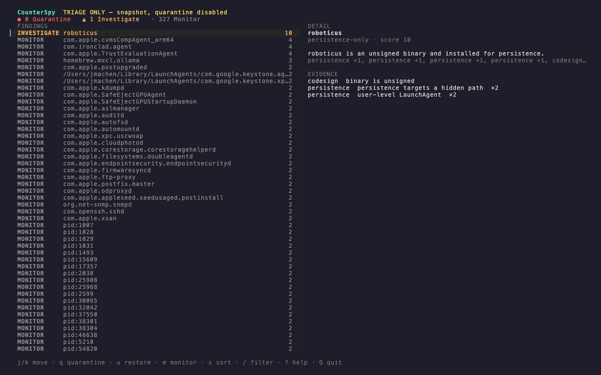
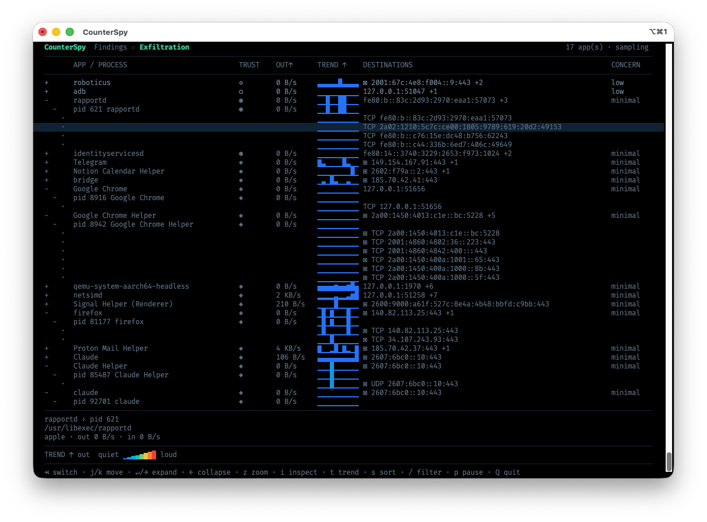
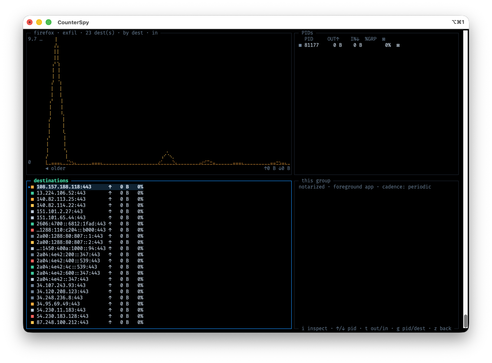
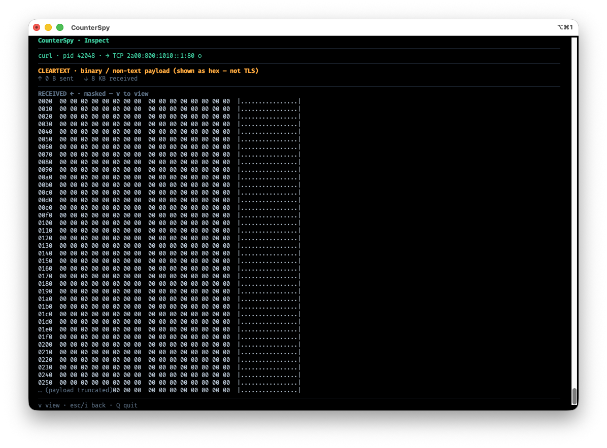
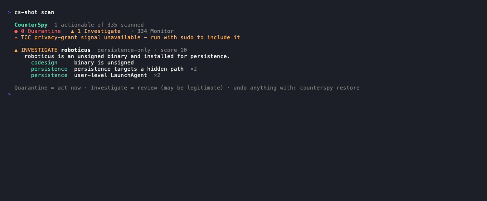

<p align="center">
  <picture>
    <source media="(prefers-color-scheme: dark)" srcset="docs/assets/counterspy-dark.svg">
    
  </picture>
</p>

# CounterSpy 🕵️

[](https://github.com/robot-accomplice/counterspy/actions/workflows/ci.yml)
[](https://codecov.io/gh/robot-accomplice/counterspy)


[](LICENSE)

A macOS command-line tool that triages your Mac for spyware-like activity, watches what your
trusted apps are **sending** and where, and — with your approval — **reversibly** quarantines
suspicious items. It ranks everything in plain language, reads no payloads it can't honestly
read, and **never deletes**.

> ### ⚠️ Run under `sudo` for full visibility
> Without it, the **TCC privacy-grant signal** — which apps hold Screen Recording, Input
> Monitoring, Full Disk Access, and friends — is **unavailable**, and CounterSpy **says so
> explicitly**. It never silently reads as "clean": a signal it couldn't collect is reported as a
> **gap**, never as an all-clear. It recommends; you decide. (See the
> [known limitation](docs/threat-model.md#known-limitation--false-positive-volume-read-before-shipping)
> on false-positive volume before treating any output as a verdict.)

---

## What it looks like

**Triage (`scan` / `console` → Findings)** — spyware-shaped findings ranked by concern, each
expandable into the correlated evidence and provenance behind it. Monitor-tier noise is counted,
not detailed.

<p align="center">
  
</p>

**Exfiltration monitor (`console` → Tab)** — a live, per-app "egress top": outbound rate, a trend
sparkline, destinations (with a `▣` TLS / `□` cleartext glyph), and an inferred exfil concern —
all through the code-sign trust + provenance lens.

<p align="center">
  
</p>

**Zoom (`z`)** — blow up any app into a btm-style dashboard: a braille throughput graph (one line
per PID, or **per destination** via `g` — shown here), a selectable, color-matched table with each
row's rate and %-of-group share, its destinations, and group metadata. `g` moves focus between the
PIDs and destinations boxes.

<p align="center">
  
</p>

**Inspect (`i`) — honest per-flow coverage.** Capture and inspect a single flow. It never
overstates or hides what it sees: a flow reads as "encrypted" only with real TLS evidence, and the
captured bytes are **always shown** — readable text as text, cleartext-binary as a hexdump (never
mislabeled as encrypted). Secrets stay masked until you press `v`.

<p align="center">
  
</p>

**Plain CLI report (`scan`)** — an executive summary and only the actionable findings. Synthesis,
not a dump.

<p align="center">
  
</p>

## Install

**Prebuilt binary** — a checksum-verified universal binary (Apple Silicon + Intel), no Go toolchain needed:

```sh
curl -fsSL https://raw.githubusercontent.com/robot-accomplice/counterspy/main/install.sh | sh
```

**Homebrew** *(once the tap is published)*:

```sh
brew install robot-accomplice/tap/counterspy
```

**Manual** — download a `.tar.gz` from [Releases](https://github.com/robot-accomplice/counterspy/releases)
and extract. Builds aren't notarized yet (signing is imminent) — `curl | sh` and Homebrew sidestep
Gatekeeper, but a *browser* download needs `xattr -d com.apple.quarantine ./counterspy` before first run.

## Use

```sh
sudo ./counterspy scan                # ranked report (READ-ONLY, never mutates)
sudo ./counterspy scan --json         # machine-readable []Assessment (feeds CI / the ABORT gate)
sudo ./counterspy scan --interactive  # walk findings top-down: quarantine per item (y/N/q)
sudo ./counterspy restore <manifest>  # undo a prior quarantine

sudo ./counterspy console             # interactive UI: Findings + Exfiltration (Tab to switch)
./counterspy console --from scan.json # drive Findings from a `scan --json` snapshot (no sudo)
sudo ./counterspy console --json      # one-shot, machine-readable Exfiltration snapshot (non-TTY)
```

- **Findings** (master-detail triage): `j/k` navigate · `q` quarantine (with a confirm +
  reversibility prompt) · `u` restore this session · `s`/`/` sort/filter · `?` help · `Q` quit.
- **Exfiltration** (`Tab`): `↵`/`→` expand · `z` zoom · `i` inspect · `t` trend (out/in/combined) ·
  `p` pause. In the zoom, `g` switches focus between the PIDs and destinations boxes.

The console needs a real terminal; piped, it prints a one-shot report and tells you to use `scan`.
And again — **run under `sudo`** (see the callout above): without it the TCC signal is missing and
the report shows a gap, not a clean bill of health.

## Reading the marks

Each finding is tagged with a four-slot glyph cluster —
`[concern] [trust] [run-state] [socket]` — read left to right. Color also encodes
the concern tier, so the marks never rely on color alone. This key is generated
from the code, so it always matches what the tool emits:

<!-- BEGIN LEGEND (generated) -->
| Mark | Axis | Meaning |
|---|---|---|
| ⚑ | concern | quarantine |
| ▲ | concern | investigate |
| · | concern | monitor |
| ● | trust | Apple system code |
| ◆ | trust | notarized (Developer ID, accepted) |
| ◇ | trust | signed, not notarized |
| ○ | trust | unsigned |
| ⊘ | trust | revoked certificate |
| ▸ | liveness | active (running now) |
| ◐ | liveness | armed (loaded, fires on a trigger — no live PID) |
| † | liveness | dormant (disabled or target missing — cannot execute) |
| ↔ | liveness | live network socket |
| ▣ | encryption | TLS-encrypted flow (□ = cleartext) |
| ◉ | intercept | decrypted (plaintext captured) |
| ⦸ | intercept | pinned (app rejected our leaf — bypassed, not decrypted) |
| ◌ | intercept | opaque (not interceptable) |
| ⨯ | intercept | capture/relay error (traffic not tampered with) |
<!-- END LEGEND -->

---

## How it works

A strict three-phase pipeline (see [design spec](docs/superpowers/specs/2026-07-08-counterspy-design.md)):

```
collect (read-only) ──▶ score (pure) ──▶ interpret ──▶ report / act (consented)
 persistence                weighted      verdict +      exec summary +
 codesign          ──▶      correlation   category +  ▶  ranked findings;
 tcc                        + tripwires   recommendation  quarantine = disable+move
 process+network                                          (reversible, manifest)
```

- **Synthesis, not a dump.** The report leads with an executive summary and shows only
  actionable findings (Quarantine / Investigate); low-signal Monitor items are counted,
  not detailed.
- **Correlated evidence.** A listener spawned by a LaunchAgent from an unsigned binary
  that also holds Input Monitoring is one story told four ways — that correlation is how
  it beats single-signal noise.

## The Exfiltration monitor & inspector

The Exfiltration monitor (`counterspy console`, then `Tab`) answers the complementary question to
the scanner — not *"is this spyware?"* but *"this app is trusted; what is it sending, where, and
how much?"* It's a live "egress top" built by polling `nettop` + `lsof` (no entitlements, no packet
capture for the tree; observe-only):

- **Per-app rollup** — every PID, port, and protocol of an app collapses into one expandable row:
  outbound rate, a trend sparkline, destinations, and a cadence (one-off / bursty / steady /
  periodic). A per-destination encryption glyph (`▣` TLS · `□` cleartext · blank = unknown) is
  inferred from the port.
- **Destination names** — a passive DNS observer (port-53 capture, needs sudo) resolves each IP to
  the hostname the app actually looked up, so the tree/zoom/inspect show `analytics.example.com`
  instead of a bare cloud IP. Honest about gaps: a connection opened before the console started, or a
  system using encrypted DNS (DoH/DoT), shows its **IP** — never a fabricated name. A destination
  with no name is a mild, *corroborated* concern nudge (only alongside another signal, never alone).
- **Trust + provenance lens** — each row carries its code-sign trust glyph and process ancestry, so
  a notarized app talking to its vendor reads as *expected* while an unsigned background daemon
  uploading to a raw IP reads as *elevated*.
- **Inferred exfil risk** — capability × egress: an app holding Screen Recording or Input Monitoring
  **and** uploading is flagged with the candidate data categories it *could* be leaking. Inference,
  never confirmed content.
- **Zoom (`z`)** — a btm-style dashboard for one app: a braille throughput graph (one line per PID,
  or per destination via `g`), a selectable table with each PID's rate + %-of-group share, its
  destinations, and metadata. `g` moves focus between the PIDs and destinations boxes; the arrow
  keys and the graph grouping follow the focused box, and `i` inspects the selection.
- **Inspect (`i`)** — capture and inspect one flow (native `/dev/bpf`, needs sudo) with an **honest
  coverage verdict**: an encrypted flow is reported as metadata-only (size + destination, no
  payload), and plaintext is shown masked until you press `v`. Cleartext HTTP is decoded —
  dechunked and gzip/deflate-decompressed — so a compressed body reads as text, not a hexdump.

## Decrypting TLS (`intercept`) — opt-in, consented, read-only

The monitor and inspector can *name* destinations and read cleartext, but TLS payloads stay opaque.
`counterspy intercept` goes one step further and shows **what** your own machine is sending inside
TLS — on your own hardware, with your explicit consent, and fully reversible.

It is a **read-only decrypt mirror**. When armed it installs a local, single-purpose CA as a trusted
root and registers as the system **HTTPS proxy**. Apps `CONNECT` through it; the proxy terminates each
connection's TLS with a per-SNI leaf, **re-dials the real server verified normally**, relays every byte
**unmodified**, and captures the decrypted plaintext — decoded and secret-masked — for viewing. Nothing
in the traffic is altered or blocked (that's a later phase); this only *reveals*.

Arm it (consent prompt, then a live socket — the default output):

```sh
sudo counterspy intercept
```

Watch the decrypted flows, in another shell, as your normal user:

```sh
counterspy console --intercept
```

Also persist to a rotating 0600 JSONL log, and read it back (the log is root-owned, so viewing it takes
`sudo`; `$HOME` rather than `~`, which your shell won't expand after an `=`):

```sh
sudo counterspy intercept --log
sudo counterspy console --intercept="$HOME/.counterspy/flows.jsonl"
```

Revert the CA trust + redirect (this also happens automatically on exit):

```sh
sudo counterspy intercept --uninstall
```

- **Consented, per launch** — a `y/N` prompt spells out exactly what arming does (default No; `--yes`
  bypasses for scripted use). Everything is reverted on exit, panic, `Ctrl-C`, or `--uninstall`.
- **Honest about what it couldn't decrypt** — a cert-pinned app that rejects the leaf is shown as
  `pinned` (bypassed, not decrypted), non-TLS as `opaque`; only a `decrypted` flow carries plaintext,
  so the view never implies content it doesn't have.
- **Secrets masked** — bearer tokens, cookies, API keys, PEM blocks, and credential fields are masked
  *before* any flow leaves the proxy.
- **Cooperative, and honest about it** — apps that honor the system proxy (Safari, Chrome, and anything
  on CFNetwork/NSURLSession — which is most native software, including telemetry SDKs) are seen. Software
  that deliberately ignores the proxy is **not** intercepted, and that gap is visible rather than hidden:
  the Exfiltration monitor still shows those flows via `nettop`, they just won't appear here. Catching
  evasive software needs a NetworkExtension transparent proxy — a later phase.
- **Scope** — this phase is decrypt/visibility only; redacting or blocking outbound payloads is Phase 3.

> ⚠️ Arming installs a machine-wide trusted MITM root and points your system HTTPS proxy at localhost.
> It's meant for inspecting **your own** traffic on **your own** machine. macOS + root; treat as
> experimental.

> **Note:** `curl` does *not* honor the macOS system proxy (it reads `https_proxy`). To test with curl,
> point it at the proxy explicitly: `curl -x 127.0.0.1:62443 https://example.com/`. A browser needs no
> such help.

## Safety guarantees

- **Never deletes** — quarantine only moves, into `~/CounterSpyQuarantine/<timestamp>/`.
- **Reversible** — `restore` round-trips byte-identically and refuses to clobber.
- **Never touches** Apple-signed/allowlisted items or protected system paths.
- **Fails loud** — a collector that can't read reports a gap, never silence.
- **Auditable** — deterministic, rule-based verdicts; `manifest.json` is undo + RCA trail.

## Field feedback (opt-in)

CounterSpy can measure its own false-positive rate from the field — but only if you
opt in. **It is off by default and never phones home unless you turn it on.**

In the TUI, press `g` to mark the selected finding a **false positive** (legitimate) or
`b` to confirm it was **correctly flagged**. Labels are stored locally under your home
(`~/.config/counterspy/`, resolved to the invoking user even under `sudo`).

Sharing is a separate, consent-gated step controlled by `~/.config/counterspy/feedback.json`:

```jsonc
{
  "share": "off",      // "off" (default) | "ask" (confirm each session) | "always"
  "detail": "public",  // "public" (default) | "full" (also include private identity + path)
  "endpoint": ""        // your push-only submission URL; empty = local export file only
}
```

What leaves your machine is an **anonymous fingerprint**, never raw data: the signals that
fired, a score *band*, the category, code-sign status, and a path *class* — no raw paths,
usernames, or hostnames. An app's identity is included only when it's recognizably public
(Apple-namespace or Gatekeeper-notarized); a private app's identity stays local unless you
choose `detail: "full"`. Use `counterspy feedback list` to see exactly what's queued and
`counterspy feedback submit` to send with a confirmation prompt.

**Egress-only by design:** the feedback channel is push-only. It sends; it never *reads*
from the network — no remote config, no fetched allowlists, no update checks. An
anti-spyware tool must never be remotely steerable, so this is enforced in code
(`TestEgressOnly`), not just promised.

## Build from source

```sh
go build -o counterspy .
```

Requires **Go 1.26+** and the macOS SDK (cgo — code-signature checks call `Security.framework`
in-process; a non-cgo build is refused at compile time so a release can't silently ship without
codesign). No third-party dependencies beyond [`tcell`](https://github.com/gdamore/tcell)
(vendored) for the terminal UI; everything else is the Go standard library and system frameworks.

## Testing

Deterministic, mock-driven, and CI-safe: the exec edges (`nettop`, `lsof`, `ps`, `codesign`,
TCC) and the terminal are behind injectable seams, so the whole suite runs in GitHub Actions
without sudo or external tools. Coverage is gated at **≥80%** per package in CI (currently
**91%** overall).

```sh
go test ./...                          # full suite
go test ./... -cover                   # per-package coverage
```

## Not for

Kernel/firmware implants, SIP-protected components, or signed supply-chain malware —
see the [threat model](docs/threat-model.md) for the full scope and non-goals.

## License

Code and documentation are [MIT](LICENSE). The CounterSpy mark
(`docs/assets/counterspy-*.svg`) is **not** covered by that grant: it is © 2026 Jonathan Machen,
all rights reserved, and may not be reused, modified, or redistributed without permission.
